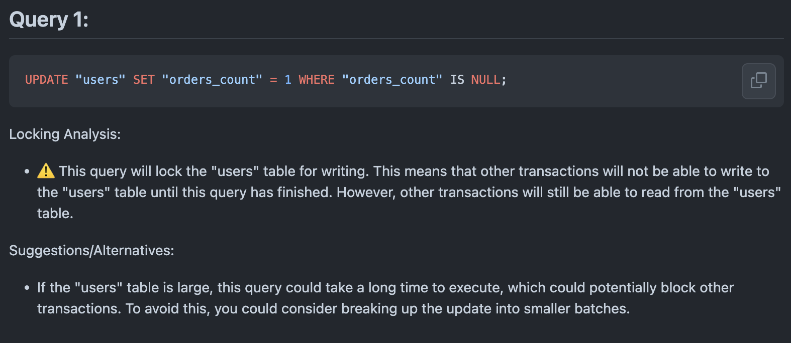

# AI Pull Request Review

This action has been created to use OpenAI API to performs some custom analysis on pull request.  
The bot will create and try to update (if existing) a comment with OpenAI result.

## Example usage

> [!WARNING]  
> A personal GitHub token with at least `read:user, repo` scopes is needed.

1. Detect if your Pull Request SQL migration will lock your database :

   ```yaml
   jobs:
     review-sql-migrations:
       name: Review SQL migrations
       timeout-minutes: 3
       runs-on: ubuntu-latest
       steps:
         - name: "Checkout code"
           uses: actions/checkout@v4
         - name: Generate prompt
           run: |
             echo -e "Given a large dataset Postgres database version $POSTGRES_VERSION, for each distinct SQL query at the end of my prompt, knowing that they will be executed into a single transaction.
             Please precise if each query will locks the table, which type of postgres lock it will uses and if it will prevents other transactions from reading or writing to the table.
             Answer with suggestions and recommendations for how to avoid it (do not include NOWAIT option). Include indexes suggestions if you think he can speed up any query.
             Your answer should follow the following format :
   
               ## Query 1:
                   \`\`\`sql
                   <SQL Query>
                   \`\`\`
                   Locking Analysis:
                     - <start with a warning emoji if this lock the database, then detailed analysis with bold result of the locking result>
   
                   Suggestions/Alternatives:
                     - <Detailed suggestions>
   
               ## Query 2:
                   \`\`\`sql
                   <SQL Query>
                   \`\`\`
                   Locking Analysis:
                     - <start with a warning emoji if this lock the database, then detailed analysis with bold result of the locking result>
   
                   Suggestions/Alternatives:
                     - <Detailed suggestions>" >> prompt.txt
   
              echo OPENAI_PROMPT=$(cat prompt.txt) >> $GITHUB_ENV
              echo OPENAI_SYSTEM_MESSAGE="You are a SQL expert and knowledgeable about large datasets in Postgres version $POSTGRES_VERSION."
           env:
             POSTGRES_VERSION: 15
         - name: SQL Migration review
           uses: appchoose/ai-pr-review@1.0.0
           with:
             prompt: ${{ env.OPENAI_PROMPT }}
             openai_system_message: ${{ env.OPENAI_SYSTEM_MESSAGE }}
             openai_model: "gpt-4"
             openai_temperature: 0.1
             files_path: "path/to/your/migrations/folders"
             github_token: ${{ secrets.AI_PR_REVIEW_GITHUB_TOKEN }}
             github_pr_id: ${{ github.event.pull_request.number }}
           env:
             OPENAI_API_KEY: ${{ secrets.OPENAI_API_KEY }}
   ```

   This will comment your pull request like this :
   
