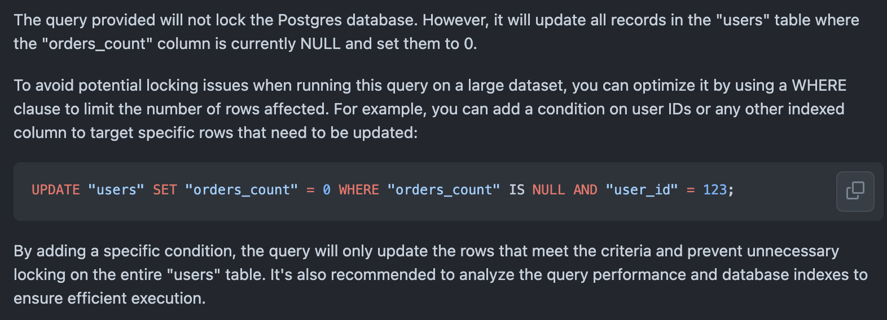

# AI Pull Request Review

## Usage

> [!WARNING] A GitHub token with at least `read:user, repo` scopes is needed.

1. Detect if your SQL migration will lock your database
   ```yaml
   - name: Generate prompt
     run: |
       POSTGRES_VERSION=15
       OPENAI_PROMPT="As a backend developer, given a Postgres database version $POSTGRES_VERSION, tell me if the query will lock the database and how to avoid it : "
       echo "OPENAI_PROMPT=$OPENAI_PROMPT" >> "$GITHUB_ENV"
   - name: Test Action
     id: test-action
     uses: appchoose/ai-pr-review@1
     with:
       github_token: ${{ secrets.AI_PR_REVIEW_GITHUB_TOKEN }}
       github_pr_id: ${{ github.event.pull_request.number }}
       prompt: ${{ env.OPENAI_PROMPT }}
       files_path: 'path/to/your/migrations/folder'
     env:
       OPENAI_API_KEY: ${{ secrets.OPENAI_API_KEY }}
   ```
   This will comment your pull request like this :
   
